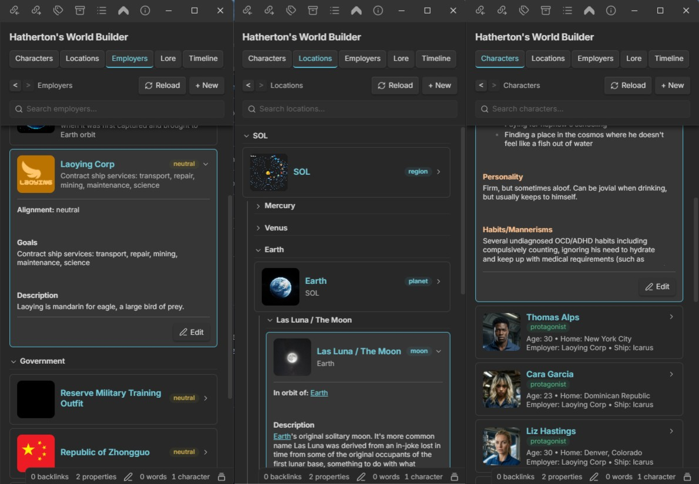

# Hatherton's World Builder

A fiction world-building toolkit for Obsidian: characters, locations, employers, lore entries, and timeline events.  This plugin is a fork of World Builder originally authored by wesswart77.  It has been adapted to work well outside of a fantasy setting and instead puts an emphasis on sci-fi.

## Features

- **Characters** — name, role, age, employer, ship, home, physical description, personality, goals
- **Locations** — name, type, parent location, description, inhabitants, secrets
- **Employers** — name, type, subsidiary of, alignment, goals, enemies, allies, description
- **Lore Entries** — title, category (history/tech/religion/culture/other), content
- **Timeline Events** — date/era, title, description, linked characters/locations
- **World Sidebar** — tabbed view across all five entry types
- **Bookmarks** — bookmark any entry from its expanded view, and open them all from the Bookmarks button in the section header
- **Search** — a search bar pinned under the section header on every tab (each tab keeps its own text); type to hide whatever doesn't match, all words must match. Characters are matched on name, employer, ship and home; the other tabs on the name and the text of the note

## Settings

- **World folder** — where all world-building notes are stored (default: `World`)

## Changes from upstream

Everything below was added or changed in this fork (by liamhatherton), compiled from the commit history.

### Sci-fi setting and data model

1. **Factions renamed to Employers.** The tab, folder (`World/Employers`), "New Employer" command and modal, and the character `employer` field all replace the old faction wording.
2. **"Magic" lore category renamed to "Tech".**
3. **New location types:** planet, dwarf planet, moon, station, asteroid, belt and ship, alongside the original city/region/building/landmark/other.
4. **Optional Ship and Home fields on characters.** Both are in the New Character form and written to the note's frontmatter.
5. **Employer types.** Employers get a Type dropdown (Corporation, Government, Military, Criminal), saved to frontmatter and shown in the note body.
6. **New character note template.** Colored section headings (Origin, Physical Description, Occupation, Resume, Role In Story, Goals, Personality, Habits/Mannerisms, Earlier Life, Internal Conflicts, External Conflicts). Text entered in the form goes under its heading and the rest are left empty to fill in later. The Secrets field was removed.

### Sidebar cards

7. **Character portraits.** Each character card shows a thumbnail of the first image embedded in the note (wiki or markdown embeds, local files or image URLs). Portrait and border sizes were adjusted afterwards.
8. **Thumbnails for Locations and Employers**, the same way as characters.
9. **Clearer character card details.** Two labelled lines, "Age · Home" then "Employer · Ship". Empty values are left out and the role badge sits on its own line.
10. **Expandable cards.** Clicking a card expands a text-only preview of the note inside the sidebar instead of opening it. The preview leaves out frontmatter, images and the repeated title heading, and has an Edit button to open the note.
11. **Frontmatter values with quotes are read correctly.** Quoted values (`"..."` / `'...'`) are unquoted before they are displayed.

### Organization and ordering

12. **Characters grouped by employer.** Each employer gets a collapsible section, sorted alphabetically with "No Employer" last. Collapsed state is remembered.
13. **Employer logos on character group headers.** The logo is the first image in the matching employer note.
14. **Drag-and-drop ordering.** Cards can be dragged into a custom order. This started with characters (within their employer group) and now covers every tab. The order is saved in plugin data (notes are never modified) and still applies after a note is renamed.
15. **Hierarchical Locations tab.** Locations nest under their `parent` location (plain names and `[[wiki links]]` both work, and cycles are ignored). Each level can be reordered separately, and dragging a parent moves its whole subtree with it.
16. **Collapsible location tree.** Every location has a collapsible label, and collapsing a parent hides its subtree. Nested labels keep their own saved state.
17. **Ships section.** Ship-type locations are never nested because they move around. They get their own collapsible Ships section at the bottom of Locations.
18. **Employers grouped by type** into collapsible Corporation / Government / Military / Criminal / Unassigned sections, each with its own drag-to-reorder list. An employer with a `subsidiary-of` property (set from the New Employer form, or by hand; plain names and `[[wiki links]]` both work) is shown under its parent's card in a collapsible **Subsidiaries** label instead of its own type section. If the parent can't be found, it stays in its type section.

### Navigation and search

19. **Fixed sidebar header.** The title, tabs, section header and search bar stay put while the list below scrolls, with a shadow when the list is scrolled. Scroll position is kept across redraws.
20. **Improved search.** The search bar sits under each tab's section header, and each tab keeps its own query. Every word typed must match, ignoring case and accents. Characters match on name, employer, ship and home, and the other tabs on the name plus the note text. Non-matching cards and empty groups are hidden, a "No … match" line appears when nothing matches, and Esc or the clear button resets the search. On Locations, the parents of a matching entry stay visible.
21. **Back/Forward navigation.** Back and forward buttons in the section header step through a history of tab switches and expanded cards. The current card gets an accent border.
22. **Wiki links inside the sidebar.** Clicking a `[[link]]` in an expanded preview jumps to that entry's card: it switches tab, opens collapsed groups, clears a hiding search, then expands and scrolls to the card. Links outside the world folder open normally.
23. **Reload button** in the section header, to redraw the sidebar on demand.
24. **Bookmarks.** Every expanded entry has a bookmark button on the left of its footer (opposite Edit); it turns the accent color when the entry is bookmarked. A Bookmarks button to the left of Reload in each section header swaps the list for a Bookmarks view, with bookmarked entries grouped by section (collapsible and drag-to-reorder). Clicking the button again returns to the last section. Bookmarks are kept in plugin data and follow renames.
25. **Click-to-zoom photos.** When an entry with a photo is expanded (Characters, Locations, Employers and Bookmarks), hovering the photo shows a magnifier badge in its top-right corner, and clicking it opens the image full-screen. Scroll to zoom, drag to pan, and click or press Esc to close, with no need to open the note first.
26. **Double-click to collapse a section.** Double-clicking the tab you're already on (Characters, Locations, Employers, Lore or Timeline) closes every expanded card and folds every collapsible group in that section. The folded state is saved like a manual fold.

### Branding

27. **Rebranded as "Hatherton's World Builder"** with a new plugin ID (`world-builder-lh`), author, description and package name, and an orbit icon for the ribbon and sidebar instead of the globe. Credit to the original author, wesswart77, is kept.
