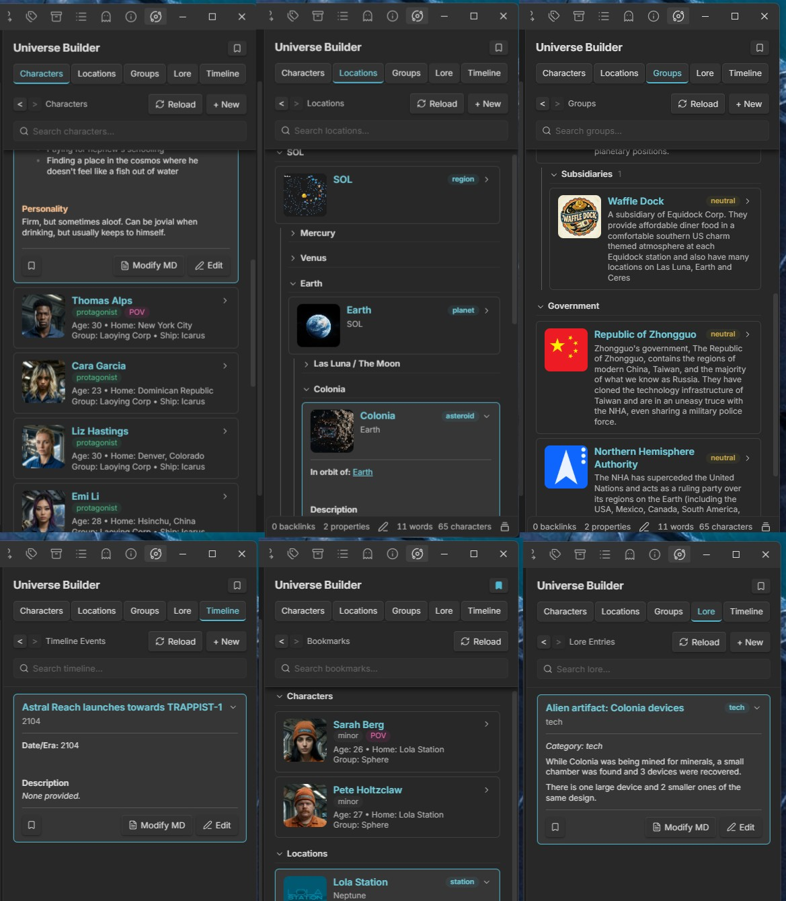

# Universe Builder

A fiction world-building toolkit for Obsidian: characters, locations, groups, lore entries, and timeline events.  This plugin is a fork of World Builder originally authored by wesswart77.  It has been adapted to work well outside of a fantasy setting and instead puts an emphasis on sci-fi.

## Features

- **Characters** — name, role, age, group, ship, home, physical description, personality, goals
- **Locations** — name, type, parent location, description, inhabitants, secrets
- **Groups** — name, type, subsidiary of, alignment, goals, enemies, allies, description
- **Lore Entries** — title, category (history/tech/religion/culture/other), content
- **Timeline Events** — date/era, title, description, linked characters/locations
- **World Sidebar** — tabbed view across all five entry types
- **Bookmarks** — bookmark any entry from its expanded view, and open them all from the Bookmarks button in the section header
- **Search** — a search bar pinned under the section header on every tab (each tab keeps its own text); type to hide whatever doesn't match, all words must match. Characters are matched on name, group, ship and home; the other tabs on the name and the text of the note

## Settings

Requires Obsidian 1.13.0 or later. Settings are declared with Obsidian's declarative settings API, so both appear in the Settings search box.

- **Universe folder** — where all Universe Builder notes are stored (default: `UniverseBuilder`). Changing it doesn't move existing notes

## Moving notes out of the World folder

Earlier versions stored notes in `World/`, the same folder the original World Builder plugin uses. Universe Builder now defaults to `UniverseBuilder/` so the two plugins' notes stay separate.

If a vault has Universe Builder notes in `World/`, the plugin asks once per update what to do:

- **Move to UniverseBuilder/ (recommended)** — moves the `Characters`, `Groups`, `Locations`, `Lore` and `Timeline` folders from `World/` into `UniverseBuilder/`. Anything else in `World/` is left alone. If the move leaves `World/` with no files (empty folders don't count), you're then asked whether to delete it; **Delete** sends it to the trash per Obsidian's *Deleted files* setting, and closing the dialog without choosing asks again next launch. A vault that also has the original plugin's `World/Factions` notes never gets this question. Obsidian keeps links to the moved notes up to date, and the plugin updates its bookmarks, custom ordering and collapsed sections. Files that already exist at the destination are skipped, never overwritten, and listed afterwards
- **Keep World/, ask again next update** — keeps using `World/` and asks again when the next version is installed
- **Keep World/, don't ask again** — keeps using `World/` for good

If the World Builder plugin is installed, the prompt warns that it won't see the notes once they're moved. The prompt doesn't appear when the **Universe folder** setting is a custom folder, or when `World/` has no notes in those five folders.

To move later (for example after choosing *don't ask again*), or to get the delete offer back after choosing *Keep*, run **Move notes out of the World folder** from the command palette.

Folder paths typed into other plugins or notes, such as a Dataview query on `"World"`, aren't changed by the move.
- **Sidebar editor** — what the Edit button on an expanded entry opens: **Live Preview** (Obsidian's own editor, the default) or **Raw markdown** (a plain text box holding the whole file, frontmatter included). See [Undocumented Obsidian API](#undocumented-obsidian-api)

## Changes from upstream

Everything below was added or changed in this fork (by liamhatherton), compiled from the commit history.

### Sci-fi setting and data model

1. **Factions renamed to Groups.** The tab, folder (`Groups`), "New Group" command and modal, and the character `group` field all replace the old faction wording.
2. **"Magic" lore category renamed to "Tech".**
3. **New location types:** planet, dwarf planet, moon, station, asteroid, belt and ship, alongside the original city/region/building/landmark/other.
4. **Optional Ship and Home fields on characters.** Both are in the New Character form and written to the note's frontmatter.
5. **Group types.** Groups get a Type dropdown (Corporation, Government, Military, Criminal), saved to frontmatter and shown in the note body.
6. **New character note template.** Colored section headings (Origin, Physical Description, Occupation, Resume, Role In Story, Goals, Personality, Habits/Mannerisms, Earlier Life, Internal Conflicts, External Conflicts). Text entered in the form goes under its heading and the rest are left empty to fill in later. The Secrets field was removed.

### Sidebar cards

7. **Character portraits.** Each character card shows a thumbnail of the first image embedded in the note (wiki or markdown embeds, local files or image URLs). Portrait and border sizes were adjusted afterwards.
8. **Thumbnails for Locations and Groups**, the same way as characters.
9. **Clearer character card details.** Two labelled lines, "Age · Home" then "Group · Ship". Empty values are left out and the role badge sits on its own line.
10. **Expandable cards.** Clicking a card expands a text-only preview of the note inside the sidebar instead of opening it. The preview leaves out frontmatter, images and the repeated title heading, and has a Modify MD button to open the note (plus an inline Edit toggle, see 27).
11. **Frontmatter values with quotes are read correctly.** Quoted values (`"..."` / `'...'`) are unquoted before they are displayed.

### Organization and ordering

12. **Characters grouped by group.** Each group gets a collapsible section, sorted alphabetically with "No Group" last. Collapsed state is remembered.
13. **Group logos on character group headers.** The logo is the first image in the matching group note.
14. **Drag-and-drop ordering.** Cards can be dragged into a custom order. This started with characters (within their group group) and now covers every tab. The order is saved in plugin data (notes are never modified) and still applies after a note is renamed.
15. **Hierarchical Locations tab.** Locations nest under their `parent` location (plain names and `[[wiki links]]` both work, and cycles are ignored). Each level can be reordered separately, and dragging a parent moves its whole subtree with it.
16. **Collapsible location tree.** Every location has a collapsible label, and collapsing a parent hides its subtree. Nested labels keep their own saved state.
17. **Ships section.** Ship-type locations are never nested because they move around. They get their own collapsible Ships section at the bottom of Locations.
18. **Groups grouped by type** into collapsible Corporation / Government / Military / Criminal / Unassigned sections, each with its own drag-to-reorder list. An group with a `subsidiary-of` property (set from the New Group form, or by hand; plain names and `[[wiki links]]` both work) is shown under its parent's card in a collapsible **Subsidiaries** label instead of its own type section. If the parent can't be found, it stays in its type section.

### Navigation and search

19. **Fixed sidebar header.** The title, tabs, section header and search bar stay put while the list below scrolls, with a shadow when the list is scrolled. Scroll position is kept across redraws.
20. **Improved search.** The search bar sits under each tab's section header, and each tab keeps its own query. Every word typed must match, ignoring case and accents. Characters match on name, group, ship and home, and the other tabs on the name plus the note text. Non-matching cards and empty groups are hidden, a "No … match" line appears when nothing matches, and Esc or the clear button resets the search. On Locations, the parents of a matching entry stay visible.
21. **Back/Forward navigation.** Back and forward buttons in the section header step through a history of tab switches and expanded cards. The current card gets an accent border.
22. **Wiki links inside the sidebar.** Clicking a `[[link]]` in an expanded preview jumps to that entry's card: it switches tab, opens collapsed groups, clears a hiding search, then expands and scrolls to the card. Links outside the Universe folder open normally.
23. **Reload button** in the section header, to redraw the sidebar on demand.
24. **Bookmarks.** Every expanded entry has a bookmark button on the left of its footer (opposite Modify MD / Edit); it turns the accent color when the entry is bookmarked. A Bookmarks button to the left of Reload in each section header swaps the list for a Bookmarks view, with bookmarked entries grouped by section (collapsible and drag-to-reorder). Clicking the button again returns to the last section. Bookmarks are kept in plugin data and follow renames.
25. **Click-to-zoom photos.** When an entry with a photo is expanded (Characters, Locations, Groups and Bookmarks), hovering the photo shows a magnifier badge in its top-right corner, and clicking it opens the image full-screen. Scroll to zoom, drag to pan, and click or press Esc to close, with no need to open the note first.
26. **Double-click to collapse a section.** Double-clicking the tab you're already on (Characters, Locations, Groups, Lore or Timeline) closes every expanded card and folds every collapsible group in that section. The folded state is saved like a manual fold.
27. **Inline editing in the sidebar.** An expanded entry's footer has Modify MD (opens the note in the main editor) and Edit. Edit replaces the preview with Obsidian's own Live Preview editor for the note's text (formatting shown as you type, `[[link]]` suggestions, editor hotkeys such as bold), with the note's properties in a small raw YAML **Properties** box above it. The buttons become Cancel and Save. Nothing is written to the file until you Save, which updates the note and returns to the preview, with the card's name, badges and grouping updated. Cancel discards the changes (asking first if anything changed). Only one entry is edited at a time: clicking Edit on another card saves the open one first. Ctrl/Cmd+S or Ctrl/Cmd+Enter also save, Esc cancels, and collapsing a card with unsaved edits asks first. If the note was changed elsewhere while you were editing, saving asks before overwriting it. The Live Preview editor relies on an undocumented Obsidian API (see [Undocumented Obsidian API](#undocumented-obsidian-api)); the **Sidebar editor** setting switches to a plain raw-markdown text box instead.
28. **Drag an image onto a card to set its portrait.** Drop an image file (e.g. from File Explorer) onto any Characters, Locations or Groups card, collapsed or expanded; the card is outlined while the image is over it. If the entry already has a portrait, you're asked whether to replace it: No changes nothing, Yes swaps that image's embed for the new one in place (keeping any size such as `|300`). If it has no portrait, the image is embedded at the very top of the note, right after its properties and before the title heading. Images from outside the vault are copied into your attachment folder (per Obsidian's *Files and links* settings), the same as dropping them into the editor; images already in the vault are linked where they are.

## Undocumented Obsidian API

Obsidian's public plugin API has no supported way to put its Live Preview editor inside a custom view. The sidebar's inline **Edit** (Live Preview mode) gets one anyway through Obsidian internals. This is the only place the plugin uses undocumented API; everything else uses the public API.

### Where it's used

All of it lives in `src/main.ts`, in the section **"Inline editors (sidebar Edit button)"**, inside the block marked `⚠ UNDOCUMENTED OBSIDIAN API ⚠`:

- `resolveLivePreviewEditorClass()` — builds a throwaway markdown embed with `app.embedRegistry.embedByExtension.md(...)`, sets `embed.editable = true`, calls `embed.showEditor()`, and takes the constructor two prototypes up from `embed.editMode`. That's Obsidian's internal (scrollable) markdown editor class. The result is cached, and `null` means "unavailable".
- `createLivePreviewEditor()` — creates an instance of that class in the expanded card, passing a stand-in "owner" object that mimics the parts of `MarkdownView` the editor expects (`getMode`, `onMarkdownScroll`, `editor`, `file`, ...). It then uses the instance's `set()`, `.editor` / `.cm`, `updateBottomPadding()`, and sets `app.workspace.activeEditor` so editor hotkeys work. It also proxies `app.vault.config` to turn off line numbers and fold arrows in the sidebar.

The caller is `startEditing()` inside `toggleCardExpand()`, which picks the editor based on the `inlineEditor` setting.

This is the same technique the [Kanban plugin](https://github.com/mgmeyers/obsidian-kanban) uses for its card editor (`getEditorClass()` in its `src/main.ts`, and `src/components/Editor/MarkdownEditor.tsx`), also written up as the [Embeddable Markdown Renderer snippet](https://fevol.github.io/obsidian-notes/notes/snippets/embeddable-markdown-renderer/). If an Obsidian update breaks it, Kanban's source is the first place to look for the fix.

### If an Obsidian update breaks it

1. **Automatic fallback.** If the internal editor can't be created (the embed registry or editor class is missing, or construction throws), the plugin logs a warning to the developer console (`Universe Builder: Live Preview editor unavailable ...`) and opens the raw markdown text box instead. Editing keeps working, just without formatting.
2. **Switch it off by hand.** If the editor still appears but misbehaves (wrong layout, keys not working, text not saving correctly), go to **Settings → Universe Builder → Sidebar editor** and choose **Raw markdown**.
3. **Remove it from the code entirely.** To revert to the raw-markdown editor permanently:
   - In `startEditing()` (inside `toggleCardExpand()`), replace the `editor = (... createLivePreviewEditor(...) ...) ?? createRawEditor(...)` assignment with `editor = createRawEditor(body, entry.file, original, keys);`.
   - Delete the `⚠ UNDOCUMENTED OBSIDIAN API ⚠` block: `LivePreviewEditorClass`, `livePreviewEditorClass`, `resolveLivePreviewEditorClass()` and `createLivePreviewEditor()`. Keep `splitFrontmatter()` only if something else still uses it.
   - Optionally remove the `inlineEditor` setting (its field in `UniverseBuilderSettings`, its default in `DEFAULT_SETTINGS`, the line in `loadSettings()`, and the "Sidebar editor" entry in `UniverseBuilderSettingTab.getSettingDefinitions()` / `setControlValue()`) and the `.wb-card-editor-body` / `.wb-card-editor-props` / `.wb-card-editor-label` rules in `styles.css`.
   - Remove the `Scope` and `Component` imports if nothing else uses them.

### The raw-markdown alternative

`createRawEditor()` is the fallback and needs no internals. It's a plain auto-growing `<textarea>` holding the note's **entire file** (frontmatter included), exactly as read with `app.vault.read()`. Save writes the textarea's contents back with `app.vault.modify()`. It follows the same Save / Cancel / one-entry-at-a-time rules and keyboard shortcuts (Ctrl/Cmd+S or Ctrl/Cmd+Enter to save, Esc to cancel, Tab inserts a tab). Because it uses only standard DOM and public API, Obsidian updates can't break it.
